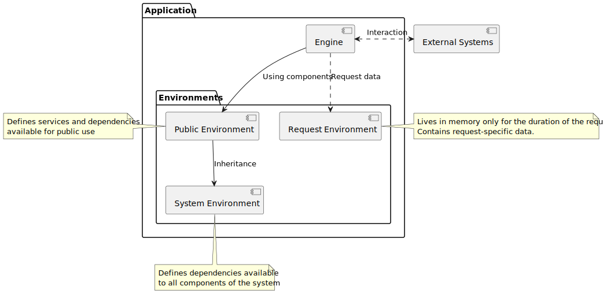

# Application 

Provides **scaffolding** for building a `BackEnd` application that is designed 
to function as an `API`, with components that will be permanently loaded into memory.

## Architecture

Read more about the [Application pattern](docs/01-architecture).