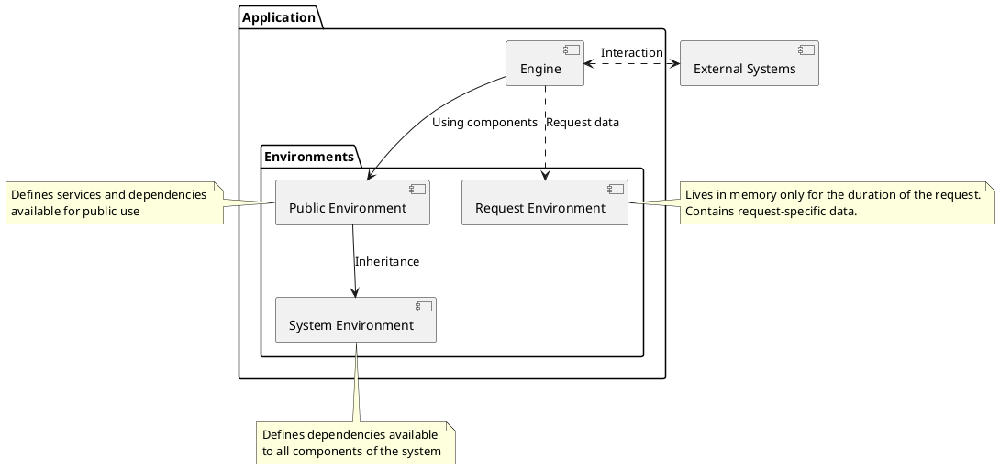

# Architecture

## Overview

This document describes the `Application` pattern of this package.
This pattern is intended for developing a `BackEnd` focused on `API` and remote procedure calls.

The `Application` pattern uses the `Service Manager` pattern, 
forming a unified framework together with it.

## Basic Concepts

The `Application` represents a collection of services 
(which are generally always loaded into memory and never unloaded) 
with which the `Engine` interacts. 

The `Engine` is a component that ensures the application interacts with external agents. 
For example, 
* a `web server` can be considered an Engine. 
* `Console` input can be considered an Engine, 
* a `WebSocket` server can be considered an Engine, and so on.

It is accurate to state that the method of interaction between the `Engine` 
and the application can be standardized, 
meaning the implementation of services can be independent of the `Engine`'s 
representation.

The `Application` is responsible for organizing services and components. 
To achieve this, the `Application` defines environments.

An `environment` is a component that ensures dependency resolution.

The `Application` always uses two environments:

* Public Environment
* System Environment

The `Public Environment` defines components and services available for external interaction. 
The `System Environment` defines services and components available to the entire application.

If the application operates in `Web-server` mode, meaning it processes requests, 
then it can use the `Request Environment`. 
However, the existence of the `Request Environment` is not mandatory.

## The Interface Adapters as Public Environment

The Principle of Single Logic Definition states that a service, 
once created, should function consistently across different environments and `Engines`. 
This idea seems promising.

Let's consider an example. 
Suppose you have a service that outputs the string "Hello World." 
No matter which `Engine` you invoke this service in, 
you should get the expected output. 
And it seems that if you have a way to describe this behavior once, 
it should save you from writing additional code.

However, different `Engines` require additional execution details. 
For example, in a `REST API`, you need to specify how the request should be dispatched. 
For `console` output, you need to specify the command name that will trigger the output of the string to the screen. 
If it's `RabbitMQ`, you likely need to package the string into a message.

You could use attributes to specify this information. 
However, attributes violate the `SOLID` principles and essentially mix pure service code 
with knowledge of how a particular `Engine` works.

All of this leads to the conclusion that in addition to services containing pure business logic, 
you also need services that act as adapters for their usage.

In Clean Architecture, there is a layer called `Interface Adapters`, 
which is designed to provide access to business logic from various `Engines`. 
The equivalent of this layer is the `Public Environment`, 
which defines service adapters.

In practice, this means that to invoke the "Hello World" business logic service, 
you must create a service adapter that resides in the `Public Environment` 
and hides the implementation details of the `Engine`.