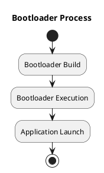
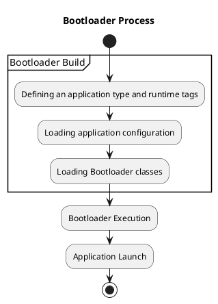
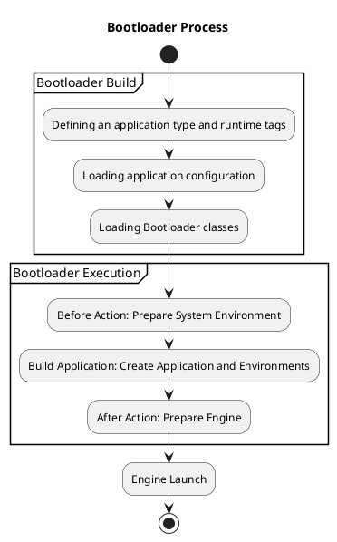

# Bootloader

## Bootloader Process

The `Bootloader` component handles the application's loading 
and initialization process.

The `Bootloader` component is started by the `Runner` strategy, 
which is responsible for initializing and starting the application loading process.

The process is carried out in several stages:



Bootloader construction is performed by the `BootloaderManager`, which executes the following stages:

* Defining the `application type` and `runtime tags`
* Loading the application configuration
* Loading all Bootloader classes that form the `BootloaderExecutor`



The `BootloaderExecutor` executes handlers in a specified sequence of three stages:

* BeforeAction - Initializes the environment. 
Executed before the `Application` and `SystemEnvironment` classes are created.
* BuildApplication — Creates the application and the necessary environments.
* AfterAction — Executed after the application is created, but before the `Engine` is launched.



Once the `Engine` has started, the initialization process is considered complete. The application is loaded into memory and is ready to operate.

## Service manager bootloader

The Service Manager is the only mandatory component that must always be initialized for the `SystemEnvironment`. 
If it is not specified during the creation of the `BootloaderExecutor` object, 
it is initialized by default using the `ServiceManagerBootloader` class.

To avoid the default initialization, 
you need to explicitly define the dependencies in one of the `Bootloader` classes: 
either `ServiceLocatorInterface` or `ExecutorInterface`.

## Bootloader Registry

The list of classes and components involved in the boot process is stored in the registry. 
By default, the `BootloaderBuilderByDirectory` class uses ini files and the bootloader directory. 
Each component corresponds to a separate file named **componentName.ini**, 
where an array of bootloader classes is defined.

You can modify the bootloader registry manager by defining your own bootloader.php file in the root of the project. 
See the implementation of `BootManagerApplication` for reference:
```php
    public static function run(string $appDir, array $command = null): never
    {
        $appDir                     = $appDir.'/bootloader';
        
        if(file_exists($appDir) === false) {
            echo 'Bootloader directory not found: '.$appDir.PHP_EOL;
            exit(1);
        }
        
        if(file_exists($appDir.'/bootloader.php')) {
            $manager                = include_once $appDir.'/bootloader.php';
        } else {
            $manager                = new BootManagerByDirectory($appDir);
        }

```

## Creating a Bootloader

A Bootloader class must implement the `BootloaderInterface` contract, 
which gives it access to the application loading context.

```php
final class SomeBootloader implements BootloaderInterface
{
    #[\Override]
    public function buildBootloader(BootloaderExecutorInterface $bootloaderExecutor): void
    {
        // define dependency for the EngineInterface
        $bootloaderExecutor->getBootloaderContext()
            ->getSystemEnvironmentBootBuilder()
            ->bindConstructible(EngineInterface::class, NativeEngine::class);
    }
}
```

The Bootloader class has two possible scenarios of influence:

1. It can define the `system`, `public` environment, or the constructor algorithm for the `request environment`.
2. It can define an initializer that will be executed later during the application startup phase.

In most cases, the first scenario is enough. 
However, there are situations where you need to make decisions 
about loading components based on the application context, 
which becomes available later, after startup. 

In such cases, the Bootloader class must define 
a handler that will be executed later. 
This approach allows handling more complex initialization scenarios.

```php
final class SomeBootloader implements BootloaderInterface
{
    #[\Override]
    public function buildBootloader(BootloaderExecutorInterface $bootloaderExecutor): void
    {
        $bootloaderExecutor->addAfterHandler($this->initialize(...));
    }
    
    private function initialize(...): callable
    {
        // Initialization code here when application is already running
    }
}
```

## Application Type Initialization

You can create multiple types of applications (e.g., Console or Web server) 
that will be initialized differently.

To control the application loading based on type or configuration, 
there are two options available to the developer:

* Use the `for_application` option in the Bootloader configuration, 
which specifies for which type of application the component should be used.
* Use the Bootloader context to manage initialization through 
code depending on configuration, roles, or application type.

The BootloaderContextInterface provides several methods that are typically useful
for determining which components need to be initialized:
* `getApplicationType` — returns the type of application being initialized.
* `getExecutionRoles` — returns the roles that are currently being applied.
* `getApplicationConfig` — returns the application configuration.

We recommend using these methods to determine the components for application initialization,
as these parameters are as abstracted from specific configurations as possible.
However, you should avoid using the last method unless absolutely necessary.

The more complex rules you use,
the harder it will be to debug the application,
and the more potential errors other developers working with your component may make.
Therefore, you should strive for simplicity whenever it is sufficient.

## Runtime tags and execution roles

Additionally, for controlling component loading in the application, `runtime tags` and `execution roles` 
are used.

`Runtime tags` are a set of tags defined at the start of the application.
`Execution roles` are a set of tags defined in the application configuration.

Before execution begins, the `Runner` calculates the execution roles and attaches them to the `Runtime tags`. 
During the Bootloader class loading, the loader uses the `Runtime` tags to filter the list.

`Execution roles` enable creating a monolithic application that functions like "microservices." 
The roles are defined in the configuration, which can vary across different nodes. 
This way, you can run different instances of the application on various nodes, 
each performing different aspects of tasks while still using a unified codebase. 
This approach is very convenient for certain use cases.

For example, you can (and should) use different nodes for long-running background tasks and for handling web requests. 
In this case, your `Engine` stack for handling web requests could be `Swoole`, 
while on another node, an `AMPHP server` would be running.

## After or Before Action Handlers

The `Bootloader` class can define handlers that will be executed.

The `BootloaderExecutor` class implements the `BeforeAfterExecutorInterface`, 
which means you can use three methods to define handlers: `Before`, `Main`, and `After`.

We do not recommend using the `Main` stage, 
as it is intended for starting the application, 
and you could unintentionally break the logic if you don't fully understand what is happening.

The `Before` and `After` handlers are preferable. 
The difference between them is that the `After` handler can request the 
`SystemEnvironment` object, `Engine`, and other available dependencies. 
We do not recommend using the `After` handler unless absolutely necessary. 
The `After` handler is problematic because it can have side effects on the environment, 
may unintentionally initialize dependencies that are unnecessary during the application's operation, and so on. 
Use it carefully.

## Component Installation

From the application's perspective, a component is considered installed if it has registered itself with the `Bootloader` 
and is therefore available to other components through `Dependency Injection`.

Since components are most often developed as `Composer` packages, 
their installation process is handled by a special installer that extends Composer.
