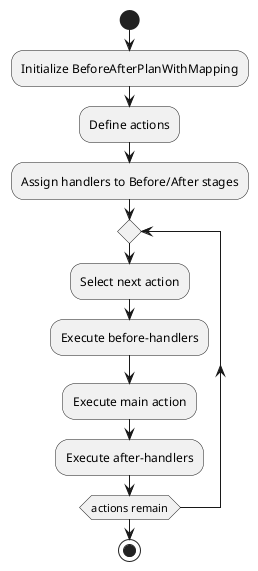

# BeforeAfterPlanWithMapping

## What is it?

The `BeforeAfterPlanWithMapping` class extends the `ExecutionPlanWithMapping` and 
adds functionality to manage "Before" and "After" steps associated with specific actions. 
This class ensures that the handlers for these steps are executed in the correct order relative 
to the corresponding action.

## When to use it?

Use the `BeforeAfterPlanWithMapping` pattern when:

* You need to execute specific handlers before or after certain actions within an execution plan.
* You want to ensure that "Before" and "After" steps are organized and executed in the correct sequence.
* You require a structured way to add additional logic around the primary actions in your execution flow.

## Diagram

The following UML diagram illustrates the structure and logic of the `BeforeAfterPlanWithMapping` class:



## Examples

```php
// Example of initializing BeforeAfterPlanWithMapping with actions and handlers
$plan = new BeforeAfterPlanWithMapping($handlerExecutor, ['myAction']);

// Adding a handler to be executed before an action
$plan->addBeforeActionHandler('myAction', fn() => echo 'Before myAction executed');

// Adding a handler to be executed after an action
$plan->addAfterActionHandler('myAction', fn() => echo 'After myAction executed');

// Executing the entire plan
$plan->executePlan();
```

## Key Methods

- **`addBeforeActionHandler(string $action, mixed $handler, InsertPositionEnum $insertPosition = InsertPositionEnum::TO_END): static`**  
  Adds a handler to be executed before the specified action.

- **`addAfterActionHandler(string $action, mixed $handler, InsertPositionEnum $insertPosition = InsertPositionEnum::TO_END): static`**  
  Adds a handler to be executed after the specified action.

## Implementation Details

The `BeforeAfterPlanWithMapping` class is designed to allow precise control over the execution order of handlers related to specific actions. This makes it ideal for scenarios where pre- and post-processing are necessary around core actions.
