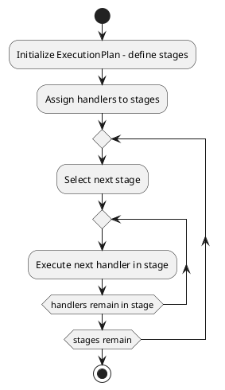

# ExecutionPlan

## What is it?

The `ExecutionPlan` class is designed to manage the execution of a set of `stages`,
where each `stage` consists of multiple `handlers`.
This class provides a flexible way to organize the execution process by controlling
the **order of stages** and the handlers within them.
The primary purpose is to allow for a structured and organized approach
to handling complex workflows.

## When to use it?

Use the `ExecutionPlan` pattern when:

* You want to manage the execution of a set of stages, where each stage consists of multiple handlers.
* You want to organize the execution process by controlling the order of stages and the handlers within them.
* You want to allow for a structured and organized approach to handling complex workflows.

## Diagram

The following UML diagram illustrates the structure 
and interactions within the `ExecutionPlan` class:



## Examples

```php
// Example of initializing the ExecutionPlan with stages and handlers
$executionPlan = new ExecutionPlan($handlerExecutor, ['stage1', 'stage2']);

// Adding handlers to stages
$executionPlan->addStageHandler('stage1', fn() => echo 'Stage 1 handler executed');
$executionPlan->addStageHandler('stage2', fn() => echo 'Stage 2 handler executed');

// Executing the entire plan
$executionPlan->executePlan();
```