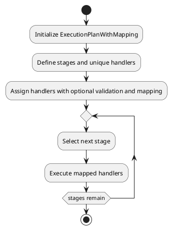

# ExecutionPlanWithMapping

## What is it?

The `ExecutionPlanWithMapping` class extends the `ExecutionPlan` class 
and introduces additional functionality for managing unique handlers that are mapped by specific hashes or identifiers. 
This allows for enhanced control over the execution plan by ensuring that certain handlers are unique 
and can be easily retrieved or checked within the execution flow.

## When to use it?

Use the `ExecutionPlanWithMapping` pattern when:

* You need to manage handlers that should be unique within a specific stage of the execution plan.
* You want to map handlers using specific identifiers (hashes) for easy retrieval and execution.
* You require additional validation and control over the addition and execution of handlers within the stages.
* You want to find a handler by its hash or identifier.

## Diagram

The following UML diagram illustrates the structure and logic of the `ExecutionPlanWithMapping` class:



## Examples

```php
// Example of initializing ExecutionPlanWithMapping with stages and handlers
$plan = new ExecutionPlanWithMapping($handlerExecutor);

// Adding a unique handler to a stage
$plan->addStageUniqueHandler('stage1', $handler, false, $prevHandler, null, InsertPositionEnum::TO_END);

// Finding a handler by its hash
$handler = $plan->findHandlerByHash($hash);

// Executing the entire plan
$plan->executePlan();
```

## Key Methods

- **`findHandlerByHash(int|string|null $hash): ?callable`**  
  Finds a handler by its hash or identifier within the execution plan.

- **`addStageUniqueHandler(string $stage, mixed $handler, bool $noRedefine = false, mixed $afterHandler = null, mixed $beforeHandler = null, InsertPositionEnum $insertPosition = InsertPositionEnum::TO_END): static`**  
  Adds a unique handler to the specified stage with optional validation and positioning.

## Implementation Details

The `ExecutionPlanWithMapping` class is designed for scenarios where handlers 
need to be uniquely identified and controlled within an execution plan. 
This is particularly useful for complex workflows where the uniqueness 
and retrieval of handlers are crucial.
