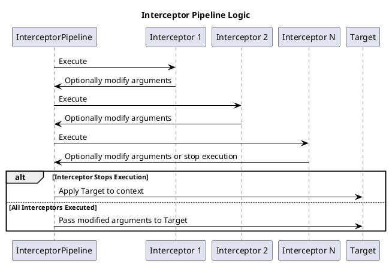

# Interceptor

## What is it?

The `Interceptor` pattern is a design pattern that allows the dynamic addition or removal of components 
(known as **interceptors**) to an execution chain without affecting the execution of other components.

## When to use it?

Use the `Interceptor` pattern when:

* You want to add functionality to an object without knowing whether it exists in the system or if it has been initialized.
* You want to add functionality to an existing object without modifying its structure.
* You want to add cross-cutting functionality to an object, such as logging or security.
* You want to separate cross-cutting functionality from the rest of the object's functionality.

## InterceptorRegistry

The `InterceptorRegistry` class is used to define collections of handlers that are associated by key (interface name). 
Typically, such a class is available in the environment to all other dependencies.
Dependencies request the `InterceptorRegistry` class and ask it to execute interceptors based on a particular key.

```php
new InterceptorPipeline(
    $target,
    $arguments,
    $registry->resolveInterceptors(\Psr\Log\LoggerInterface::class)
);
```

## What differences does it have?

1. The `ExecutionPlan` defines the execution order of predefined stages. Interceptors do not have stages.
2. After all interceptors are executed, the `Target` is executed. The `ExecutionPlan` does not have an explicit Target.
3. Interceptors manage an explicit context from the parameters, which they can modify. 

## Logic

Interceptors are executed in a context (`InterceptorPipelineInterface`) 
where the following are present:

* `Target` the target object that will receive control after all interceptors have been executed
* Arguments — an array of arguments that will be passed to the Target. 
* Interceptors are executed before the Target receives control. 
* Interceptors have the right to modify the arguments. 
* One of the interceptors can stop the execution; in that case, the `Target` will be applied to the context.

## InterceptorPipeline Diagram

The following UML diagram illustrates the logic of the `InterceptorPipelineInterface`:



## Examples

```php
class LoggerInterceptor implements InterceptorInterface
{
    public function intercept(InterceptorPipelineInterface $pipeline): void
    {
        $target                    = $pipeline->getTarget();
        $arguments                 = $pipeline->getArguments();
        
        echo 'Executing '.get_class($target).'::'.$target->getName().'('.implode(', ', $arguments).')'.PHP_EOL;
    }
}


$registry = new InterceptorRegistry;
$registry->registerInterceptor(\Psr\Log\LoggerInterface::class, new LoggerInterceptor);

new InterceptorPipeline(
    new Target,
    ['arg1', 'arg2'],
    $registry->resolveInterceptors(\Psr\Log\LoggerInterface::class)
);
```
