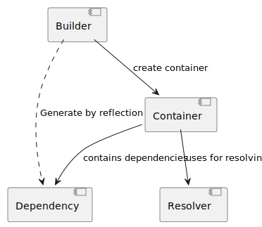

# Dependency Injection [](https://github.com/EdmondDantes/di/actions/workflows/php.yml)

`Dependency Injection` (DI) is a lightweight **extensible** `PHP` library for dependency injection
for `stateful` application.

The library is designed for `PHP 8.4` using the `LazyProxy API`.

### Features

* [Zero configuration](#zero-configuration-principle).
  (*Ability to inject dependencies without modifying the code in the dependent class*).
* [Support for the concept of `environment`/`scope`](#environment-and-scope-concepts) for dependency lookup. 
* [Support parent/child containers](#container-inheritance).
* [Constructor injection](#initialization-through-a-constructor) of dependencies
* [Injection of dependencies into properties](#initialization-through-a-method)
* Injecting configuration values as a Dependency
* [Lazy loading](#lazy-loading) of dependencies
* [Auto dereferencing a `WeakReference` inside the container](#dereferencing-a-weakreference)
* [Handling circular dependencies](#circular-dependencies)
* [Support php-attributes for describing dependencies](#special-attributes)
* [Custom dependency providers](#custom-attributes-and-providers)
* [Custom descriptor providers](#descriptor-provider)

### Installation

You can install Dependency Injector using Composer. Run the following command:

```bash
composer require ifcastle/di
```

### Basic Usage

> Please read the [Project Philosophy](#project-philosophy) section before using the library.

The example below demonstrates how the library works with the `SomeClass` class, 
which implements the SomeInterface interface.

The class definition does not depend on the `Dependency Injection` implementation. 
Dependencies are injected via the class `constructor`.

The library automatically binds dependencies to their interfaces.

```php
declare(strict_types=1);

use IfCastle\DI\ContainerBuilder;
use IfCastle\DI\Lazy;

readonly class SomeClass implements SomeInterface
{
    public function __construct(
        // Required dependency
        private SomeRequiredInterface $required,
        // Optional dependency (can be null)
        private SomeOptionalInterface $optional = null,
        // Support a complex dependency type
        private Interface1|Interface2 $someElseUnion,
        // Support a complex dependency type with interception
        private Interface1&Interface2 $someElseInterception,
        // Dependency as configuration value
        private int $configValue = 42,        
    ) {}
}

// 1. Create a container builder

$builder                    = new ContainerBuilder();
// 2. Define the constructible dependencies
$builder->bindConstructible(SomeInterface::class, SomeClass::class);
// 2. Bind several interfaces-aliases or string-key to one class
$builder->bindConstructible([Interface1::class, Interface2::class, 'string-key'], SomeElseClass::class);
// 2. Support WeakReference dereferencing
$builder->bindObject(SomeOptionalInterface::class, WeakReference::create($someObject));
// 2. Define the configuration values
$builder->set('configValue', 42);

// 3. Build the container
$container                  = $builder->buildContainer(new Resolver());

// 4. Get the dependency
$some                       = $container->resolveDependency(SomeInterface::class);

```

### Special Attributes

Attributes provide a more precise way to describe features for dependency resolution.
This library supports several attributes that can be used:

 * `Dependency`     - a general descriptor for a dependency.
 * `FromConfig`     - indicates that the dependency should be retrieved from the configuration.
 * `FromRegistry`   - indicates that the dependency should be retrieved from the registry.

```php

use IfCastle\DI\Dependency;
use IfCastle\DI\FromConfig;

readonly class SomeClass implements SomeInterface
{
    public function __construct(
        #[Dependency(key: SomeRequiredInterface::class)]
        private mixed $required,
        #[Dependency(isLazy: true)]
        private SomeOptionalInterface $optional = null
        #[FromConfig('someClass.configValue')]
        private int $configValue = 0
    ) {}
}


```

### Lazy Loading

The library supports lazy loading of dependencies by special attribute:

```php
use IfCastle\DI\Lazy;

readonly class SomeClass implements SomeInterface
{
    public function __construct(
        #[Lazy] private SomeRequiredInterface $lazy,
    ) {}
}
```

> **Warning**: Lazy dependencies are implemented using the PHP `LazyProxy` API, 
> so the same dependencies in different classes will be **different objects**!
> 
> This means the `===` operation will return `false`, 
> and `spl_object_id()` will return different values.


### Circular Dependencies

The library allows resolving circular dependencies if the dependency is not used during resolution.
If a circular dependency occurs, the library will create a `LazyProxy` object and return it.

> **Warning**: Lazy or circular dependencies cannot be used **BEFORE** 
> the process of resolving all dependencies is completed!
> ```php
> readonly class SomeClass implements SomeInterface
> {
>    public function __construct(
>    #[Lazy] private SomeRequiredInterface $lazy,
>    ) {
>       $lazy->someMethod(); // Error: CircularDependencyException
>   }
> }
> ```

### Custom attributes and Providers

You can create your own attributes to describe dependencies by implementing the DescriptorInterface.

To define a custom algorithm for dependency resolution, 
`DescriptorInterface` can implement the `getProvider` method, 
which returns the dependency.

Below is an example of a method that retrieves a value from the configuration:

```php
    #[\Override]
    public function provide(
        ContainerInterface  $container,
        DescriptorInterface $descriptor,
        ?DependencyInterface $forDependency = null,
        array $resolvingKeys = []
    ): mixed {
        $config                     = $container->findDependency(ConfigInterface::class);

        if ($config === null) {
            return null;
        }

        if ($config instanceof ConfigInterface === false) {
            throw new \TypeError('Config is not an instance of ' . ConfigInterface::class);
        }

        return $config->findValue($this->getKey());
    }

```
This way, you can extend the `DI` logic without modifying the library's code.

## Project Philosophy

This project implements a **particular algorithm** for dependency management, 
adhering to the following rule:

> If **Class A** requires a dependency by the contract **Interface**, 
> and **Class B** also requires a dependency **Interface**, 
> both classes will receive the same dependency **Class D** within a single **runtime environment**.

**The following statements are true:**

* The mapping scheme between `contracts` (`interfaces`) and `dependencies` is called the `Runtime Environment`.
* The mapping scheme is shared across all dependencies.
* A single `runtime environment` cannot have two different dependencies linked to the same contract (interface).
* A single `dependency` can be associated with `multiple contracts`.
* An application can have multiple `runtime environments` simultaneously, 
each with its own mapping schemes and `dependencies`.
* Two `runtime environments` can have a relationship: **Parent -> Child**.

### Comparison of IfCastle DI vs. Symfony and other DI implementations

| **Aspect**                              | **IfCastle DI**                                                                               | **Symfony**                                                                                 |
|-----------------------------------------|-----------------------------------------------------------------------------------------------|---------------------------------------------------------------------------------------------|
| **Dependency Resolution**               | Single container for all dependencies in one runtime environment (`Service Locator` approach) | Each service explicitly defines its dependencies, configured individually                   |
| **Same Contract Handling**              | One contract always linked to one dependency in a runtime environment                         | Allows different implementations of the same interface through qualifiers, tags, or aliases |
| **Runtime Environments**                | Supports multiple runtime environments with hierarchical relationships (**Parent -> Child**)  | Global container; separate environments typically require separate configurations           |
| **Different Dependencies for Same Key** | Not possible within the same runtime environment                                              | Fully supported using tags, aliases, or contextual bindings                                 |
| **Approach to Dependency Management**   | Service Locator-like: dependencies resolved from a shared container                           | Strict DI Container approach: dependencies injected explicitly                              |
| **Parent-Child Relationship**           | Direct support for hierarchical environments with inheritance                                 | No direct concept of parent-child environments; containers are isolated                     |

The approach of this library has **several benefits**:

* Minimal code volume due to significant simplification of logic.
* The ability to inject dependencies into a class that has not been preconfigured, 
provided the class has access to the `Runtime Environment`.
* The dependency container is created **once** at the application startup (`Bootloader Strategy`) 
and can be reused by various components without prior configuration.
* This project does not mention **AutoWire** because dependencies are already linked 
based on interface names, and this method is the *PRIMARY* approach.

## Zero configuration principle

The task of dependency resolution is typically addressed by separating the information 
about how to locate dependencies from the objects that require them. For example:

* There is a `Target` class.
* The Target class has an array of dependencies.
* Define a `TargetDependencies` class, responsible for resolving these dependencies.

Does this approach meet the SOLID principles?
The `TargetDependencies` class must duplicate *knowledge* about the required dependencies 
of the `Target` class.
However, the `Target` class is the single source of truth.

Another drawback of this solution is the increased code volume and complexity. 
The developer must now remember two points of definition related to initialization.

For this reason, modern DI approaches combine metadata for dependency resolution 
directly within the Target class.

To store metadata, attributes are used, which are directly placed in the `Target` class.
Now the knowledge about how to resolve dependencies flows into the `Target` class, 
binding it to the DI implementation.

This coupling results in components requiring a specific library for dependency resolution 
and being unable to function independently. In the absence of a standard, this hinders code reusability.

The `Zero configuration principle` suggests avoiding the use of metadata within the `Target` class, 
making it independent of any specific DI implementation.

To reduce the coupling of `Target` classes, 
our library proposes moving dependency metadata knowledge to the **contract domain**. 
In other words, information about how to resolve dependencies can be stored 
in an interface rather than in the implementation. 
This keeps dependency definitions as transparent as possible.

Example:

```php
declare(strict_types=1);

use IfCastle\DI\DependencyContract;

#[DependencyContract(new DependencyProvider())]
interface InterfaceWithDependencyContact
{
    public function someMethod(): void;
}

final readonly class ClassWithDependencyContact
{
    public function __construct(
        private InterfaceWithDependencyContact $some
    ) {}
}

```

In this case, the `ClassWithDependencyContact` class is a `Target` class,
and the `InterfaceWithDependencyContact` interface is a `Contract`.

Using the `DependencyContract` attribute, 
the interface specifies how the dependency should be resolved. 
This solution is also not ideal, but in many cases, it results in cleaner code.

See more: [Complex use cases](#complex-use-cases)

## Performance considerations

The library does not include any compilers for `dependency descriptors`, 
although their implementation is possible. 
All dependency descriptors are resolved dynamically at application startup using the `Reflection API`. 

Is this a performance issue? 
Yes, if you are using `PHP` in a stateless mode, where the PHP process terminates after each request.

For **stateful applications**, dependency resolution occurs once during the application's `warm-up phase` 
or `on-demand`, which aligns with the purpose of this library.

## Architecture



The library consists of four core **components** that interact with each other:

* `Container` — a dependency container. A key-value object that stores dependencies, where the key is typically the full name of an interface, and the value is a scalar value, a dependency descriptor, or an already initialized object.
* `Builder` — a container builder that constructs the container based on the specified dependencies.
* `Resolver` — a strategy that directly resolves dependencies.
* `Dependency` — an object that describes a dependency.

All these components are interchangeable, and by modifying them, you can change the behavior.

### Container

The dependency container follows the `ServiceLocator`/`Environment` **pattern**. 
This means that when attempting to resolve a dependency, the dependencies required by it will also be retrieved 
from the same container. 

In other words, 

> All dependencies in the `container` share the `container` as a common execution `environment`.

You can leverage this fact to create multiple execution environments, each holding its unique dependencies. 
This allows you to implement `Scope logic`, where dependency initialization depends on the environment.

By default, the container is an **immutable object** in terms of associating keys with dependencies. 
However, the container's values change during execution, as dependencies are initialized on their first use, 
replacing dependency descriptors with the actual value.

This container behavior ensures that dependencies are single instances, meaning they are the same object.

#### Container Inheritance

To provide developers with a powerful tool for managing dependencies, 
the `container` supports inheritance based on the override principle. 
This means you can create two separate containers 
with different sets of dependencies and then link them as **PARENT** and **CHILD** containers.

```php

use IfCastle\DI\Container;

$parent = new Container(new Resolver(), ['dependency1' => 'value1']);
$child = new Container(new Resolver(), ['dependency1' => 'value2'], $parent);

echo $child->resolveDependency('dependency1'); // value2

```

In this case, an attempt to resolve a dependency in the child container will result in the following behavior: 
* if the dependency is not found in the child container, the search will continue in the parent container. 
* however, if the child container has a definition for the dependency, it will be used.

#### Dereferencing a WeakReference.

The container supports **dereferencing weak references** 
if they are detected as a value. 

Using weak references is typically useful 
when defining multiple aliases for dependencies or a reference to the container itself. 
In such cases, weak references help avoid additional work for the garbage collector and prevent memory leaks. 

#### Initializer

Sometimes, it is necessary to initialize a dependency not directly through the constructor but with additional code. 
For example, loading a database driver based on configuration or context.

To solve this problem, an initializer can be used: 
a special object executed only once at the moment of dependency resolution.

To implement this approach, the library uses the `InitializerInterface`. 
If the container holds a value of type `InitializerInterface`, the container uses the `executeInitializer` method 
to obtain the dependency.

See [SelfReferenceInitializer](./src/SelfReferenceInitializer.php) as an example of an initializer 
that resolves a dependency from the container.

#### Throwable values

Container values can be `exception` objects (`Throwable`).
When attempting to resolve a dependency whose value is an exception object, 
that exception will be thrown.

This applies to both the `resolveDependency` method and the `findDependency` method. 
However, you can change this behavior by specifying the `$returnThrowable` flag 
for the `findDependency`.

Thus, 

> if a dependency was resolved **with an error once**, any later attempt 
> to retrieve this dependency will result in **the same error** without 
> attempting to resolve it again.

## Builder

The **container builder** is responsible for constructing the container based on the specified dependencies.

The current implementation uses `PHP Reflection` 
to build the container and supports the following types of dependencies:

* Dependency initialized through a constructor.
* Dependency initialized through a specific method.
* Dependency initialized via an Initializer or a closure.
* Dependency with a ready-to-use object that does not require resolution.
* Constant value.

```php

use IfCastle\DI\ContainerBuilder;
use IfCastle\DI\ContainerInterface;

$builder                    = new ContainerBuilder();
// Constructible dependencies
$builder->bindConstructible(SomeInterface::class, SomeClass::class);
// Injectable dependencies
$builder->bindInjectable(SomeRequiredInterface::class, SomeRequiredClass::class);
// Bind to Initializer 
$builder->bindInitializer(SomeOptionalInterface::class, static function (?ContainerInterface $container = null, array $resolvingKeys = []) {
    return $container->resolveDependency(SomeOptionalInterface::class, resolvingKeys: $resolvingKeys);
});
// Bind to Object
$builder->bindObject('stdClass', new stdClass());

// 3. Build the container
$container                  = $builder->buildContainer(new Resolver());
```

The builder creates a dependency descriptor where the key for the dependency is the data type. 
If a parameter has a default value, the dependency is marked as optional. 
If there is no default value, the dependency is marked as required.

A dependency can have a complex data type defined through PHP `UNION` or `INTERSECTION` expressions.
In this case, the container will look for the dependency using multiple type keys.

#### Descriptor Provider

You can override the behavior of the `Builder` by implementing the `DescriptorProviderInterface`.
There are two ways to do this:

* Implement the `DescriptorInterface::getDescriptorProvider()` method in a custom attribute.

```php

use Attribute;
use IfCastle\DI\Dependency;
use IfCastle\DI\DescriptorInterface;
use IfCastle\DI\DescriptorProviderInterface;

#[Attribute(Attribute::TARGET_PROPERTY | Attribute::TARGET_PARAMETER)]
final class CustomDescriptor extends Dependency implements DescriptorProviderInterface
{
    #[\Override]
    public function getDescriptorProvider(): DescriptorProviderInterface|null
    {
        return $this;
    }

    #[\Override]
    public function provideDescriptor(
        DescriptorInterface $descriptor,
        \ReflectionClass $reflectionClass,
        \ReflectionParameter|\ReflectionProperty $reflectionTarget,
        object|string $object,
    ): DescriptorInterface {
        // Custom logic here
    }
}

```

* Use `DependencyContract` on Interface.

```php

use IfCastle\DI\DependencyContract;

// Define custom descriptor provider for the interface
#[DependencyContract(descriptorProvider: new DescriptorProvider())]
interface InterfaceWithDependencyContact
{
    public function someMethod(): void;
}

final readonly class ClassWithDependencyContact
{
    public function __construct(
        private InterfaceWithDependencyContact $some
    ) {}
}

```

#### DependencyContract lookup logic

The `DependencyContract` attribute is inherited according to specific rules:

1. First, `DependencyContract` is checked in the current class or interface.
2. If it is not found, `DependencyContract` is checked in the **FIRST inherited interface** of the class.
3. If it is still not found, `DependencyContract` is checked further across all first descendants of the interfaces.
4. If it is not found there either, `DependencyContract` is checked for the child class, and the algorithm loops back.

In other words, the first interface has priority in the DependencyContract inheritance logic.

This inheritance algorithm is chosen to reduce the complexity for developers when searching for the `DependencyContract`.

### Initialization through a constructor

Initialization through the constructor assumes that all dependencies are defined as constructor parameters. 
In this case, the builder uses the PHP Reflection API to read the constructor's parameter list and their data types.

### Initialization through a method

For **method-based injection**, a special interface `InjectableInterface` and a trait `InjectorTrait` are used, 
which implement the injection method.

In this case, dependencies are described using attributes above the class properties. 
The class can be constructed before the dependencies are resolved.

```php
use IfCastle\DI\Dependency;
use IfCastle\DI\InjectableInterface;
use IfCastle\DI\InjectorTrait;
use IfCastle\DI\Lazy;

final class InjectableClass implements InjectableInterface
{
    use InjectorTrait;

    #[Dependency]
    protected UseConstructorInterface $required;

    #[Dependency]
    protected UseConstructorInterface|null $optional;

    #[Dependency] #[Lazy]
    protected UseConstructorInterface $lazy;

    protected string $data = '';
}

```

### Resolver

The Resolver component is responsible for the dependency resolution process. 
It handles finding dependencies of a dependency and initializing the dependency's class.

## Complex use cases

Let's consider a realistic example of using the library. 
Our goal is to develop a telemetry component (Prometheus-like) that allows defining counters as dependencies.

```php
declare(strict_types=1);

class DataBase 
{
    public function __construct(
        private string $dsn,
        private string $user,
        private string $password,
        private TelemetryCounterInterface $queryCounter,
        private TelemetryCounterInterface $errorCounter,
    ) {}
}

```

In the example above, we define two dependencies of type `TelemetryCounterInterface`. 
TelemetryCounterInterface is a telemetry counter contract that increments over time.

The initialization of such a counter is performed in two stages:

```php
// 1. Look up the registry
$registry   = $container->resolveDependency(TelemetryRegistryInterface::class);
// 2. Register the counter
$counter    = $registry->getOrRegisterCounter('test', 'some_counter', 'it increases', ['type']);
```

Let's define the `TelemetryCounterInterface` interface:

```php
class TelemetryProvider implements \IfCastle\DI\ProviderInterface
{
    public function provide(
        ContainerInterface $container,
        DescriptorInterface $descriptor,
        ?DependencyInterface $forDependency = null,
        array $resolvingKeys = [],
    ): mixed
    {
        // Here, you can use the ReflectionAPI for more complex logic
        // to determine counter-attributes
        // based on knowledge about the class where they need to be injected.
        $forClass   = $forDependency->getDependencyName() ?? 'global';        
        $registry   = $container->resolveDependency(TelemetryRegistryInterface::class);
        return $registry->getOrRegisterCounter($forClass.'_'.$descriptor->getDependencyProperty());
    }
}

#[\IfCastle\DI\DependencyContract(new TelemetryProvider())]
interface TelemetryCounterInterface  
{
    public function inc(): void;
}

```

Now we can define telemetry counters in `Target` classes, fully hiding their implementation 
details as well as the method of dependency resolution from the `Target` object.

## Environment and Scope concepts

The library's design is oriented towards usage following the `Environment` and `Scope` paradigm. 
The `Container` component acts as the `environment`, 
defining and limiting the set of dependencies that will be interconnected.

An application can define multiple containers, managing which dependencies will be applied in each case. 
Using the override mechanism, containers can inherit or override each other's dependencies.

By managing the logic of the ContainerBuilder and Resolver, which are unique to each container, 
the developer can modify the dependency resolution logic in different contexts 
without altering the code of `Target` classes.

## 