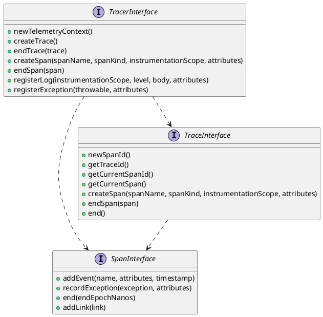

# PHP OpenTelemetry library [](https://github.com/EdmondDantes/php-open-telemetry/actions/workflows/php.yml)

An alternative version of the library for the `OpenTelemetry` standard on `PHP`.

## Why is this needed?

The original library for OpenTelemetry has a complex trace-building architecture, 
leading to an increase in supporting code. 
This library offers a simpler and flatter interface for generating telemetry.

## Installation

## Example

```php
<?php

declare(strict_types=1);

require_once __DIR__ . '/vendor/autoload.php';

use IfCastle\OpenTelemetry\Tracer;

$tracer = new Tracer(...);

$span = $tracer->createSpan('example-span', SpanKindEnum::INTERNAL);

try {
    $span->addEvent('event-name', ['key' => 'value'])
         ->setStatus(StatusCodeEnum::OK);
} catch (Throwable $exception) {
    $span->registerException($exception);
    throw $e;
} finally {
    $span->end();
}
```

## Simplified diagram

The simplified diagram shows the structure used for creating traces:

* `TracerInterface` is responsible for aggregating telemetry in the application. 
It is a factory class that creates a `Trace`.
* `TraceInterface` and `SpanInterface` represent the `Trace` and `Span` structures, 
according to the `OpenTelemetry` definitions. 
They allow manipulating the data within the entities in a convenient way.

* To record telemetry, you can use only the `TracerInterface`, or combine it with the `SpanInterface`.

